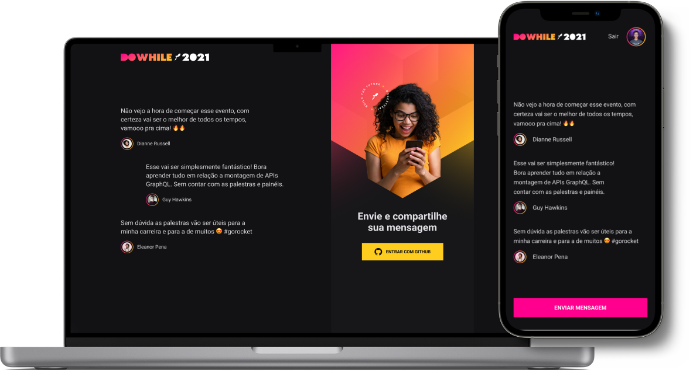

<h1 align="center">
  
</h1>

  
  

  <a href="#-layout">Layout</a> •
  <a href="#-technologies">Technologies</a> •
  <!-- <a href="#-getting-started">Getting started</a> • -->
  <a href="#-license">License</a>

  

## 🔖 Layout

You can view the project layout through the link below:

- [DoWhile Layout](https://www.figma.com/community/file/1031699316177416916/%5BNLW-Heat---Mission%3A-Impulse%5D-DoWhile2021)

Remembering that you need to have a [Figma](http://figma.com/) account to access it.

## 🚀 Technologies

- [ReactJS](https://reactjs.org/)
- [TypeScript](https://www.typescriptlang.org/)
- [React Native](https://reactnative.dev/)
- [Expo](https://expo.io/)
- [Moti](https://moti.fyi/)
- [Vitejs](https://vitejs.dev/)
- [Socket.IO](https://socket.io/)
- [React Native Stitches](https://github.com/Temzasse/stitches-native)
- [Express](https://expressjs.com/)
- [Prisma](https://www.prisma.io/)

## 📝 License

This project is licensed under the MIT License - see the [LICENSE](LICENSE.md) file for details.

---

  Made with 💜&nbsp; by <a href="https://www.linkedin.com/in/eliasgcf/">Elias Gabriel</a>

